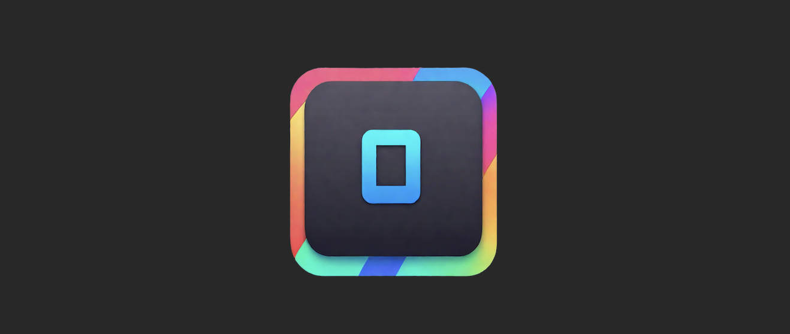
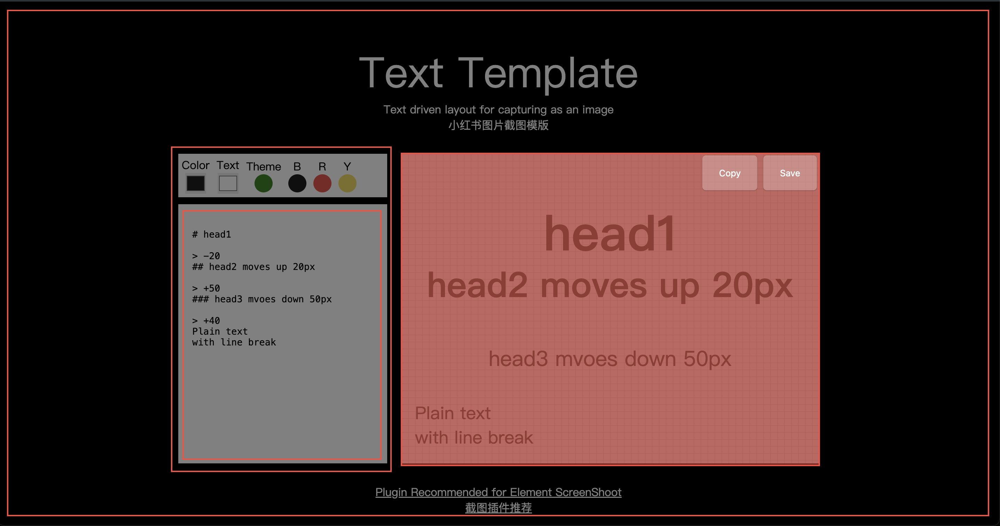

# Tailor

Tailor is a MacOS screenshot app which will automatically detect rectangle edges and copy with one click.
If no retangles are detected, it switches to selection mode.

# Demo

# Current Deficiency
`VNDetectRectanglesRequest` with Swift `Vision` is not accurate in some scenarios. 
I don't have a better solution now. Feel free to provide suggestions. Thank you.
